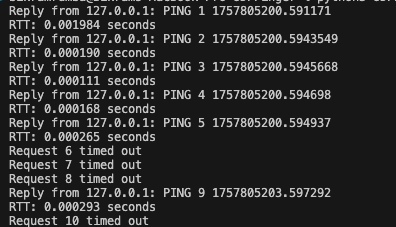

# UDP Ping Client-Server

A simple Python implementation of a ping application using UDP sockets to demonstrate network communication and packet loss simulation.

## Overview

This project consists of two programs:
- **Server**: Listens for ping messages and simulates 30% packet loss
- **Client**: Sends 10 ping messages and measures round-trip time

## Requirements

- Python 3.6+
- No external dependencies (uses standard library only)

## Files

- `UDPPingerServer.py` - Server that receives pings and simulates packet loss
- `UDPPingerClient.py` - Client that sends pings and calculates RTT

## Usage

### 1. Start the Server
```bash
python UDPPingerServer.py
```

### 2. Run the Client (in a separate terminal)
```bash
python UDPPingerClient.py
```

## Expected Output


## How It Works

- **Server**: Listens on port 12000, randomly drops 30% of packets, sends uppercase response
- **Client**: Sends 10 ping messages with 1-second timeout, calculates RTT for successful pings
- **Message Format**: `"Ping sequence_number timestamp"`

## Configuration

To change the server IP address in the client:
```python
server_host = '192.168.1.100'  # Change from '127.0.0.1'
```

To change the port (both files):
```python
server_port = 8080  # Change from 12000
```

## Troubleshooting

- **"Address already in use"**: Stop the existing server process
- **"Connection refused"**: Make sure server is running first
- **All timeouts**: Check if server is running and port is not blocked